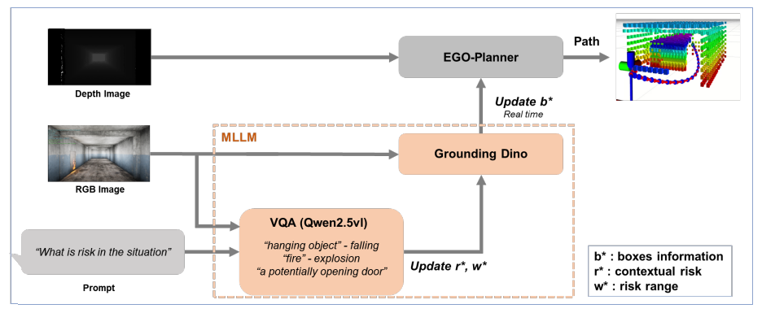
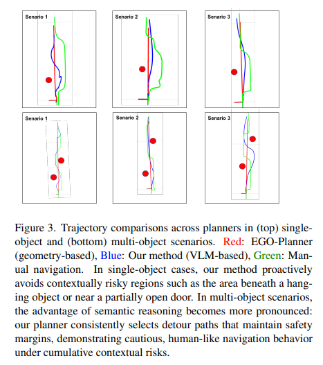
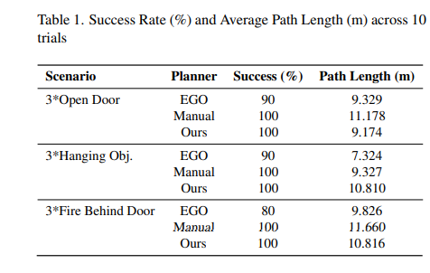

# Camera-Based Local Planning for UAVs with Contextual Risk Awareness 

### Intro
Recent advancements in autonomous robotics have emphasized the importance of integrating both geometric and contextual understanding in path planning.
While vision-language models (VLMs) have recently been applied to robotic planning, most existing work focuses on ground robots (UGVs) and primarily addresses global path planning for UAVs—requiring multiple sensors such as LiDAR and often overlooking local, real-time risk reasoning.

### Key Contributions:

💡 The first camera-only (RGB + Depth) local planner for UAVs utilizing VLMs.

💡 Real-time, context-aware risk inference directly integrated into the local planner.

💡 Demonstrated superior safety and human-like navigation in simulated risk scenarios compared to traditional geometry-based planners.

### Framework 

### Scenario
1. Implicit risk of open door
2. Potentially risk of falling object
3. Door that might explode in case of fire

### Result
- Path Comparison

  

- We evaluate each planner over 10 trials per scenario using
two metrics: (1) Success Rate (%) — the percentage of trials completed without collision; (2) Average Path Length
(m) — the total trajectory distance from start to goal.

  

### Future Works

We used a lightweight model to achieve real-time performance on UAVs.

Currently, the drone's yaw is fixed to track detected risks, but this limits its movement. In the future, we plan to allow more flexible yaw control for safer and more efficient navigation.

### Test images
#### [This is test images]

   

#### [This is simulation images ]

## Reference 

⚙️ 이 프로젝트는 [IDEA‑Research의 GroundingDINO](https://github.com/IDEA-Research/GroundingDINO) 오픈소스를 기반으로 하여,진행하였습니다.
